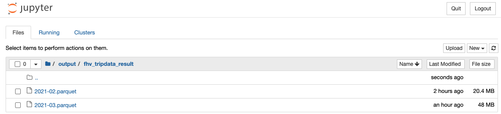

### Q1. Notebook

**What's the mean predicted duration for this dataset?**

```
mean predicted duration for the dataset: 16.191691679979066
```

### Q2. Preparing the output



**What's the size of the output file?**

```
19M
```

### Q3. Creating the scoring script

**Which command you need to execute for that?**

```
jupyter nbconvert --to=script starter.ipynb
```

### Q4. Virtual environment

**What's the first hash for the Scikit-Learn dependency?**

```
sha256:08ef968f6b72033c16c479c966bf37ccd49b06ea91b765e1cc27afefe723920b
```

### Q5. Parametrize the script

```
python starter.py --year 2021 --month 3
```

#### Output
```
mean predicted duration for the dataset: 16.298821614015107
```

### Q6 Docker contaner

```
docker run -it --rm ride-duration-prediction-service-hw:v1 python starter.py --year 2021 --month 4
```

#### Output
```
mean predicted duration for the dataset: 9.967573179784523
```